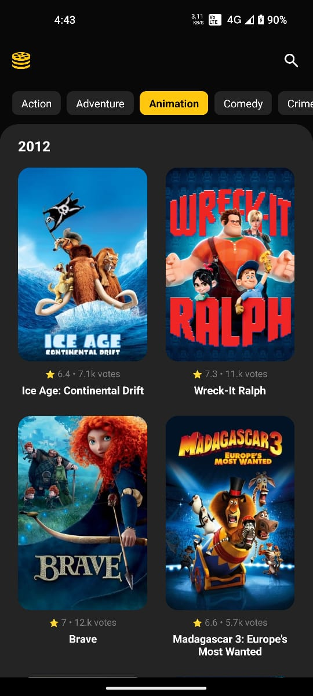
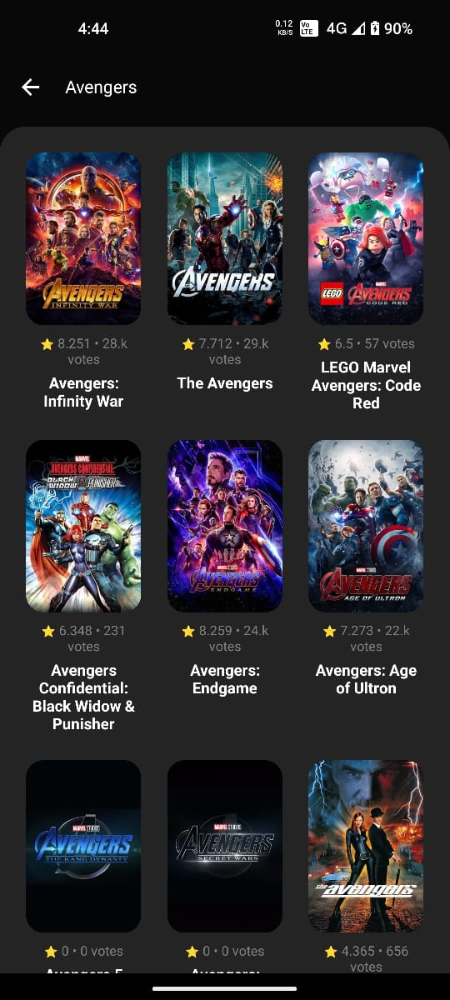

# Movie Max

Movie Max is an movie database app created with tmdb api.

### Screenshots

<table>
  <tr>
    <td valign="top"></td>
    <td valign="top"></td>
    <td valign="top"></td>
  </tr>
 </table>


# Setup Instructions
>Please make sure your react native development envirnment is setup corretly visit https://reactnative.dev/docs/environment-setup?platform=android for setup.

1. Install node modules with below command
   ```bash
    npm install
    ```
2. Make sure a android device is connected and usb debugging / wireless debugging mode is turned on.
3. Run below command to launch app on your android device
   ```bash
    npm run android:dev-release
    ```
# Features Implemented
1. Bidirectional infinite scollable Movie list.
2. Filter movies by genre
3. Search movies by title
4. Click on movie to see movie details